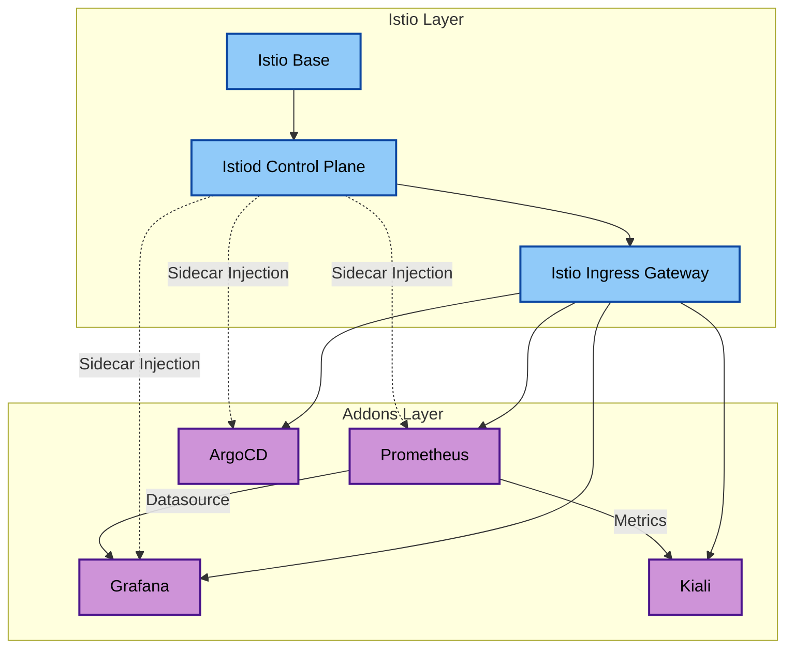

# Custom Addons for OrbitCluster EKS

This is the terraform module for creation of additional custom addons for the orbitcluster EKS platform

## Module Architecture

This module implements a **Service Mesh** architecture using **Istio**, serving as the networking foundation for all other addons.

### key Components & Connections

1.  **Istio Core (Foundation)**
    *   **istio-base**: Installs CRDs.
    *   **istiod**: The control plane. Use `istio-values.yaml` for configuration.
    *   **istio-ingress**: The **Single Entry Point** for external traffic. Exposed via a `LoadBalancer` Service.

2.  **Addon Integration (Observability & Ops)**
    *   **Prometheus**:
        *   Installed in `monitoring` namespace (labeled `istio-injection=enabled`).
        *   Sidecar injected for mTLS scraping.
        *   Exposed via Istio Ingress (`ingressClassName: istio`).
    *   **Grafana**:
        *   Uses Prometheus as the Default Datasource (auto-provisioned).
        *   Exposed via Istio Ingress (`ingressClassName: istio`).
        *   **Dependency**: Waits for default Prometheus to be ready.
    *   **Kiali**:
        *   Visualizes the mesh. Connects to the internal Prometheus service.
        *   Exposed via Istio Ingress.
    *   **ArgoCD**:
        *   **Hub Only**: Installed only if `is_hub = true`.
        *   Installed in `argocd` namespace (labeled `istio-injection=enabled`).
        *   Exposed via Istio Ingress.

### Why Argocd Spoke Role is Needed

When `is_hub = false`, this module creates an IAM role (`${cluster_name}-argocd-hub-assumable`) that enables the hub cluster's ArgoCD to deploy applications to this spoke cluster.

**Authentication Flow:**

```
1. Hub ArgoCD Pod → Hub IRSA Role (via Web Identity)
   ArgoCD uses service account to assume hub's ArgoCD role

2. Hub Role → Spoke Role (via sts:AssumeRole)
   Hub role assumes spoke's argocd-hub-assumable role

3. Get K8s Token (using spoke role credentials)
   Calls eks:DescribeCluster on spoke cluster to generate auth token

4. Deploy to Spoke
   ArgoCD uses the token to authenticate and deploy resources
```

**Configuration Required:**
```hcl
is_hub           = false
hub_cluster_name = "your-hub-cluster-name"  # Required
hub_account_id   = ""                        # Optional, defaults to current account
```

**Output:** Use `argocd_spoke_role_arn` in hub-spoke-connector configuration.

### Dependency Graph




<!-- BEGIN_TF_DOCS -->
## Requirements

| Name | Version |
|------|---------|
| <a name="requirement_terraform"></a> [terraform](#requirement\_terraform) | >= 1.5.0 |
| <a name="requirement_aws"></a> [aws](#requirement\_aws) | >= 6.15.0, <= 6.31.0 |
| <a name="requirement_helm"></a> [helm](#requirement\_helm) | >= 2.16.0 |
| <a name="requirement_kubectl"></a> [kubectl](#requirement\_kubectl) | >= 1.14.0 |
| <a name="requirement_kubernetes"></a> [kubernetes](#requirement\_kubernetes) | >= 2.35.0 |

## Providers

| Name | Version |
|------|---------|
| <a name="provider_aws"></a> [aws](#provider\_aws) | >= 6.15.0, <= 6.31.0 |
| <a name="provider_helm"></a> [helm](#provider\_helm) | >= 2.16.0 |
| <a name="provider_kubectl"></a> [kubectl](#provider\_kubectl) | >= 1.14.0 |
| <a name="provider_kubernetes"></a> [kubernetes](#provider\_kubernetes) | >= 2.35.0 |

## Modules

No modules.

## Resources

| Name | Type |
|------|------|
| [aws_eks_access_entry.argocd_hub_access](https://registry.terraform.io/providers/hashicorp/aws/latest/docs/resources/eks_access_entry) | resource |
| [aws_eks_access_policy_association.argocd_hub_admin](https://registry.terraform.io/providers/hashicorp/aws/latest/docs/resources/eks_access_policy_association) | resource |
| [aws_iam_policy.argocd_eks_describe](https://registry.terraform.io/providers/hashicorp/aws/latest/docs/resources/iam_policy) | resource |
| [aws_iam_role.argocd_hub_assumable](https://registry.terraform.io/providers/hashicorp/aws/latest/docs/resources/iam_role) | resource |
| [aws_iam_role.argocd_spoke_access](https://registry.terraform.io/providers/hashicorp/aws/latest/docs/resources/iam_role) | resource |
| [aws_iam_role_policy.argocd_assume_wildcard](https://registry.terraform.io/providers/hashicorp/aws/latest/docs/resources/iam_role_policy) | resource |
| [aws_iam_role_policy.argocd_ecr_access](https://registry.terraform.io/providers/hashicorp/aws/latest/docs/resources/iam_role_policy) | resource |
| [aws_iam_role_policy.argocd_eks_describe](https://registry.terraform.io/providers/hashicorp/aws/latest/docs/resources/iam_role_policy) | resource |
| [aws_iam_role_policy_attachment.argocd_eks_describe](https://registry.terraform.io/providers/hashicorp/aws/latest/docs/resources/iam_role_policy_attachment) | resource |
| [helm_release.argocd](https://registry.terraform.io/providers/hashicorp/helm/latest/docs/resources/release) | resource |
| [helm_release.grafana](https://registry.terraform.io/providers/hashicorp/helm/latest/docs/resources/release) | resource |
| [helm_release.istio_base](https://registry.terraform.io/providers/hashicorp/helm/latest/docs/resources/release) | resource |
| [helm_release.istio_ingress](https://registry.terraform.io/providers/hashicorp/helm/latest/docs/resources/release) | resource |
| [helm_release.istiod](https://registry.terraform.io/providers/hashicorp/helm/latest/docs/resources/release) | resource |
| [helm_release.kiali](https://registry.terraform.io/providers/hashicorp/helm/latest/docs/resources/release) | resource |
| [helm_release.prometheus](https://registry.terraform.io/providers/hashicorp/helm/latest/docs/resources/release) | resource |
| [kubectl_manifest.argocd_vs](https://registry.terraform.io/providers/gavinbunney/kubectl/latest/docs/resources/manifest) | resource |
| [kubectl_manifest.grafana_vs](https://registry.terraform.io/providers/gavinbunney/kubectl/latest/docs/resources/manifest) | resource |
| [kubectl_manifest.istio_gateway](https://registry.terraform.io/providers/gavinbunney/kubectl/latest/docs/resources/manifest) | resource |
| [kubectl_manifest.kiali_vs](https://registry.terraform.io/providers/gavinbunney/kubectl/latest/docs/resources/manifest) | resource |
| [kubectl_manifest.prometheus_vs](https://registry.terraform.io/providers/gavinbunney/kubectl/latest/docs/resources/manifest) | resource |
| [kubernetes_ingress_class_v1.istio](https://registry.terraform.io/providers/hashicorp/kubernetes/latest/docs/resources/ingress_class_v1) | resource |
| [kubernetes_namespace_v1.argocd](https://registry.terraform.io/providers/hashicorp/kubernetes/latest/docs/resources/namespace_v1) | resource |
| [kubernetes_namespace_v1.istio_system](https://registry.terraform.io/providers/hashicorp/kubernetes/latest/docs/resources/namespace_v1) | resource |
| [kubernetes_namespace_v1.monitoring](https://registry.terraform.io/providers/hashicorp/kubernetes/latest/docs/resources/namespace_v1) | resource |
| [aws_caller_identity.current](https://registry.terraform.io/providers/hashicorp/aws/latest/docs/data-sources/caller_identity) | data source |
| [aws_partition.current](https://registry.terraform.io/providers/hashicorp/aws/latest/docs/data-sources/partition) | data source |
| [aws_region.current](https://registry.terraform.io/providers/hashicorp/aws/latest/docs/data-sources/region) | data source |

## Inputs

| Name | Description | Type | Default | Required |
|------|-------------|------|---------|:--------:|
| <a name="input_app_id"></a> [app\_id](#input\_app\_id) | application Unit | `string` | `null` | no |
| <a name="input_argocd_version"></a> [argocd\_version](#input\_argocd\_version) | Version of the ArgoCD Helm chart | `string` | `"9.2.4"` | no |
| <a name="input_bu_id"></a> [bu\_id](#input\_bu\_id) | Business Unit | `string` | `null` | no |
| <a name="input_cluster_certificate_authority_data"></a> [cluster\_certificate\_authority\_data](#input\_cluster\_certificate\_authority\_data) | Base64 encoded certificate authority data for the cluster | `string` | n/a | yes |
| <a name="input_cluster_endpoint"></a> [cluster\_endpoint](#input\_cluster\_endpoint) | Endpoint URL of the EKS cluster API server | `string` | n/a | yes |
| <a name="input_cluster_name"></a> [cluster\_name](#input\_cluster\_name) | Name of the EKS cluster | `string` | n/a | yes |
| <a name="input_cluster_oidc_issuer_url"></a> [cluster\_oidc\_issuer\_url](#input\_cluster\_oidc\_issuer\_url) | URL of the OIDC issuer for the EKS cluster | `string` | n/a | yes |
| <a name="input_cluster_oidc_provider_arn"></a> [cluster\_oidc\_provider\_arn](#input\_cluster\_oidc\_provider\_arn) | ARN of the OIDC provider for IRSA (IAM Roles for Service Accounts) | `string` | n/a | yes |
| <a name="input_domain_url"></a> [domain\_url](#input\_domain\_url) | Base domain URL for the platform (e.g., orbitcluster.platform.com, xyz.company.com) | `string` | `"orbitcluster.platform.com"` | no |
| <a name="input_enable_grafana"></a> [enable\_grafana](#input\_enable\_grafana) | Enable Grafana addon | `bool` | `false` | no |
| <a name="input_enable_istio"></a> [enable\_istio](#input\_enable\_istio) | Enable Istio addon | `bool` | `false` | no |
| <a name="input_enable_kiali"></a> [enable\_kiali](#input\_enable\_kiali) | Enable Kiali addon | `bool` | `false` | no |
| <a name="input_enable_prometheus"></a> [enable\_prometheus](#input\_enable\_prometheus) | Enable Prometheus addon | `bool` | `false` | no |
| <a name="input_env"></a> [env](#input\_env) | Environment name (dev, staging, prod) | `string` | n/a | yes |
| <a name="input_grafana_version"></a> [grafana\_version](#input\_grafana\_version) | Version of the Grafana Helm chart | `string` | `"8.5.1"` | no |
| <a name="input_hub_account_id"></a> [hub\_account\_id](#input\_hub\_account\_id) | AWS account ID where the hub cluster resides. Defaults to current account if not specified. | `string` | `""` | no |
| <a name="input_hub_cluster_name"></a> [hub\_cluster\_name](#input\_hub\_cluster\_name) | Name of the hub EKS cluster. Required when is\_hub = false for spoke role trust policy. | `string` | `""` | no |
| <a name="input_is_hub"></a> [is\_hub](#input\_is\_hub) | Flag to determine if this is a hub cluster. Controls ArgoCD installation. | `bool` | `false` | no |
| <a name="input_istio_version"></a> [istio\_version](#input\_istio\_version) | Version of the Istio Helm chart | `string` | `"1.28.2"` | no |
| <a name="input_kiali_version"></a> [kiali\_version](#input\_kiali\_version) | Version of the Kiali Helm chart | `string` | `"2.20.0"` | no |
| <a name="input_prometheus_version"></a> [prometheus\_version](#input\_prometheus\_version) | Version of the Prometheus Helm chart | `string` | `"28.2.1"` | no |
| <a name="input_tags"></a> [tags](#input\_tags) | Tags to apply to all resources | `map(string)` | `{}` | no |

## Outputs

| Name | Description |
|------|-------------|
| <a name="output_argocd_namespace"></a> [argocd\_namespace](#output\_argocd\_namespace) | Namespace where ArgoCD is installed |
| <a name="output_argocd_release_name"></a> [argocd\_release\_name](#output\_argocd\_release\_name) | Name of the ArgoCD Helm release |
| <a name="output_argocd_spoke_role_arn"></a> [argocd\_spoke\_role\_arn](#output\_argocd\_spoke\_role\_arn) | IAM role ARN for hub ArgoCD to assume (only for spoke clusters) |
| <a name="output_argocd_spoke_role_name"></a> [argocd\_spoke\_role\_name](#output\_argocd\_spoke\_role\_name) | IAM role name for hub ArgoCD to assume (only for spoke clusters) |
| <a name="output_grafana_release_name"></a> [grafana\_release\_name](#output\_grafana\_release\_name) | Name of the Grafana Helm release |
| <a name="output_istio_base_release_name"></a> [istio\_base\_release\_name](#output\_istio\_base\_release\_name) | Name of the Istio Base Helm release |
| <a name="output_istio_system_namespace"></a> [istio\_system\_namespace](#output\_istio\_system\_namespace) | Namespace where Istio is installed |
| <a name="output_istiod_release_name"></a> [istiod\_release\_name](#output\_istiod\_release\_name) | Name of the Istiod Helm release |
| <a name="output_kiali_namespace"></a> [kiali\_namespace](#output\_kiali\_namespace) | Namespace where Kiali is installed |
| <a name="output_kiali_release_name"></a> [kiali\_release\_name](#output\_kiali\_release\_name) | Name of the Kiali Helm release |
| <a name="output_prometheus_namespace"></a> [prometheus\_namespace](#output\_prometheus\_namespace) | Namespace where Prometheus is installed |
| <a name="output_prometheus_release_name"></a> [prometheus\_release\_name](#output\_prometheus\_release\_name) | Name of the Prometheus Helm release |
<!-- END_TF_DOCS -->
